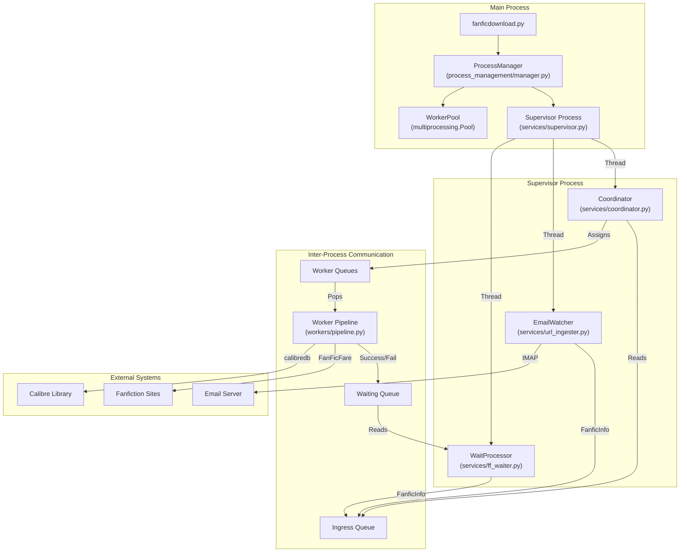
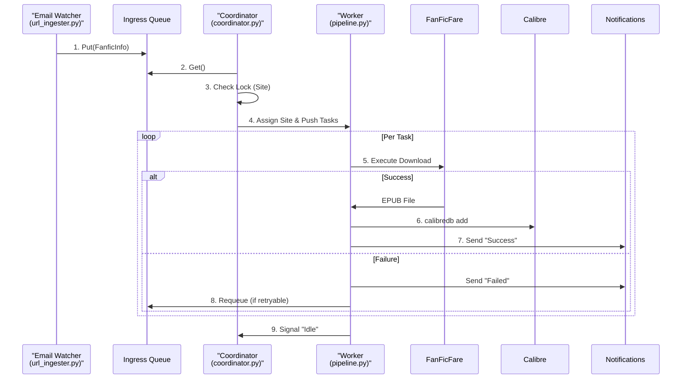

# AutomatedFanfic Architecture Deep Dive

This document serves as distinct, comprehensive documentation for the **AutomatedFanfic** system. It details the architecture, data flows, process management, and core algorithms that power the application.

## 1. High-Level System Architecture

The application uses a **Multi-Process** architecture managed by a central Supervisor. To optimize memory usage, lightweight helper services are grouped into a single **Supervisor Process** as threads, while heavy lifting is done by isolated Worker processes.

## 2. Core Components

### 2.1 The Process Manager (`process_management/manager.py`)
The `ProcessManager` is the "operating system" produced by the application.
-   **Responsibilities**: Spawning, monitoring, and killing subprocesses.
-   **Health Checks**: Periodically checks `process.is_alive()`. If a critical service dies, it auto-restarts it.
-   **Signal Handling**: Intercepts `SIGINT` (Ctrl+C) and `SIGTERM` to perform a graceful shutdown (stopping workers before exiting).

### 2.2 The Supervisor (`services/supervisor.py`)
A specialized process that hosts lightweight, IO-bound services as threads to reduce memory overhead.
-   **Memory Optimization**: Consolidates 3 python interpreters into 1, saving ~60MB+ RAM.
-   **Fault Isolation**: If a helper thread crashes, the Supervisor allows itself to restart, isolating the failure from the Main process.
-   **Threads Hosted**: Email Watcher, Waiter, Coordinator.

### 2.3 The Coordinator (`services/coordinator.py`)
*Runs as a thread within the Supervisor.*
The brain of the operation. It acts as a traffic controller to prevent getting banned by fanfiction sites.
-   **Ingress Processing**: Reads tasks from the `Ingress Queue`.
-   **Domain Locking**: Ensures **only one worker** talks to a specific domain (e.g., `fanfiction.net`) at a time.
-   **Backlog Management**: If a site is "locked" (busy), tasks are buffered in a local backlog.
-   **Assignment Strategy**:
    1.  Worker reports "Idle".
    2.  Coordinator checks backlog for unassigned sites.
    3.  Assigns a Site to the Worker.
    4.  Pushes *all* pending tasks for that site to the Worker's exclusive queue.

### 2.4 The Worker Pipeline (`workers/pipeline.py`)
The muscle. Executes the actual download/update logic.
-   **Isolation**: Runs in a separate process to prevent memory leaks or hangs from affecting the main app.
-   **Task Flow**:
    1.  Receives `FanficInfo`.
    2.  **Jail**: Creates a temporary directory context.
    3.  **Download**: Executes `FanFicFare` to download the EPUB.
    4.  **Integration**: Uses `calibredb` to add/update the book in Calibre.
    5.  **Notification**: Sends success/failure alerts.

## 3. Data Model: `FanficInfo`

The `FanficInfo` object (`models/fanfic_info.py`) is the atomic unit of work. It flows through all queues and services.

| Attribute | Purpose |
| :--- | :--- |
| `url` | Canonical URL of the story. |
| `site` | Domain identifier (e.g., `fanfiction.net`). |
| `calibre_id` | Database ID in Calibre (if exists). Used to prevent duplicates. |
| `repeats` | Integer counter for failed attempts. |
| `retry_decision` | Stores the outcome of failure logic (e.g., "Retry in 5 mins"). |

**Key Feature**: `__eq__` and `__hash__` are implemented based on `(url, site, calibre_id)`, allowing these objects to be deduplicated in Sets even across different process boundaries.

## 4. The Lifecycle of a Task

How a URL becomes a Book.

## 5. Failure Handling & Recovery

The system assumes things will fail (network issues, Cloudflare, rate limits) and is designed to handle it.

1.  **Failure Detection**: `workers/handlers.py` catches exceptions from `FanFicFare`.
2.  **Retry Logic**:
    -   **Exponential Backoff**: 1st fail -> 1 min, 2nd -> 5 mins, 3rd -> 15 mins.
    -   **Hail Mary Protocol**: If all retries fail, wait 1 hour and try one LAST time with different settings (e.g., slower speed).
3.  **The Waiter Service (`services/ff_waiter.py`)**:
    -   Failed tasks are sent here.
    -   It holds them in memory (via `threading.Timer`) until their penalty time expires.
    -   Then puts them back into `Ingress Queue` to try again.

## 6. Directory Structure Reference

-   `app/services/`: Long-running loop services.
-   `app/workers/`: 'One-off' task executors.
-   `app/process_management/`: Infrastructure code.
-   `app/calibre_integration/`: Database abstraction layer.

## 7. Key Patterns & Strategies

### 7.1 Domain Locking (Politeness Policy)
To avoid getting IP-banned by sites like FanFiction.Net, the system enforces a strict "One Worker Per Domain" rule.
-   **Mechanism**: The `Coordinator` checks `self.assignments`. If `fanfiction.net` is assigned to Worker A, no other worker can touch it.
-   **Effect**: Traffic to a single site is serialized, appearing as a single human user browsing slowly, rather than a botnet attack.

### 7.2 The "Jail" (Directory Isolation)
Every worker task runs inside a temporary directory context manager (`utils/system_utils.temporary_directory`).
-   **Purpose**: `FanFicFare` writes many temporary files. If two workers shared a folder, they would overwrite each other's configs.
-   **Safety**: When the task finishes (success or fail), the directory is strictly nuked. This prevents disk bloat and ensures a clean slate for every single run.

## 8. Developer Guidelines

### 8.1 Configuration (`models/config_models.py`)
Configuration is loaded from `config.toml` into strong Pydantic models.
-   **AppConfig**: Root configuration object.
-   **ProcessConfig**: Process management settings (timeouts, monitoring).
-   **EmailConfig**: IMAP credentials.
-   **RetryConfig**: Policies for backoff and failures.

### 8.2 Logging (`utils/ff_logging.py`)
Use the custom wrapper, **never** `print()`.
-   **`ff_logging.log(msg, level)`**: Standard logging.
-   **`ff_logging.log_debug(msg)`**: Verbose debug info.
-   **`ff_logging.log_failure(msg)`**: Specialized error formatting.
-   **Thread Safety**: This module is thread-safe and handles colorization per-worker.

### 8.3 Testing (`tests/`)
-   **Unit Tests** (`tests/unit/`): comprehensive coverage for services and pipelines.
-   **Integration Tests** (`tests/integration/`): End-to-end flows.
-   **Mocking**: Heavy use of `unittest.mock` and `freezegun` for treating time as deterministic.

## 9. Critical Rules (The "Gotchas")

1.  **NO Blocking**: The `Coordinator` loop effectively pauses the entire system. Never put `time.sleep()` or network calls directly in the coordination loop.
2.  **Always use Temp Dirs**: Never write files to the application root. Use `system_utils.temporary_directory`.
3.  **Shutdown Events**: When writing loop services, always check `shutdown_event.is_set()` rather than `while True`.
4.  **Process Safety**: `FanFicFare` is not fully thread-safe. Always run it in a separate process or strictly locked context.
